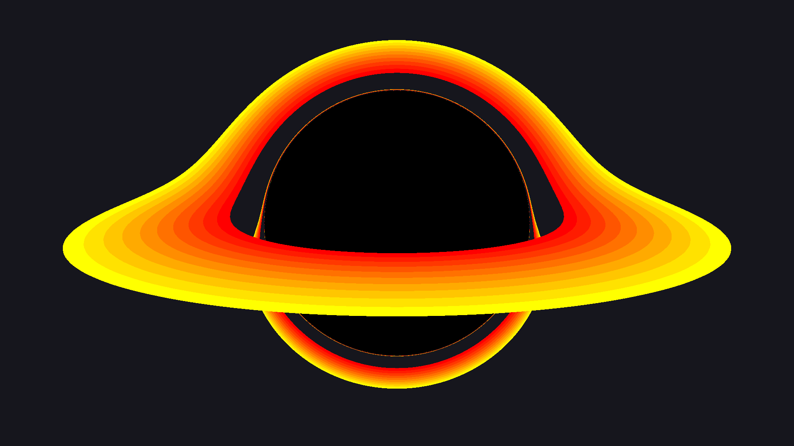

# Black Hole Simulator

A C++ black hole ray-tracing simulation with an interactive UI for camera and scene parameters.

## Example output



## Features

- Relativistic photon tracing around a black hole
- Accretion disk generation with particle and infill controls
- Adjustable camera angle, roll, anti-aliasing, and low-resolution preview mode
- Progressive render feedback in the UI

## Build

This project uses Meson + Ninja.

```bash
meson setup build
meson compile -C build
```

If `build/` already exists, only run:

```bash
meson compile -C build
```

## Run

```bash
./build/program
```

## Controls

- **Render**: start a new render
- **Anti-Aliasing**: enable higher quality sampling
- **Low Res Mode**: render quickly at reduced resolution while tweaking settings
- **Disk Particles / Infill**: adjust accretion disk appearance
- **Camera Angle / Roll**: adjust view orientation

Rendered output is written to `output/render.png`.
